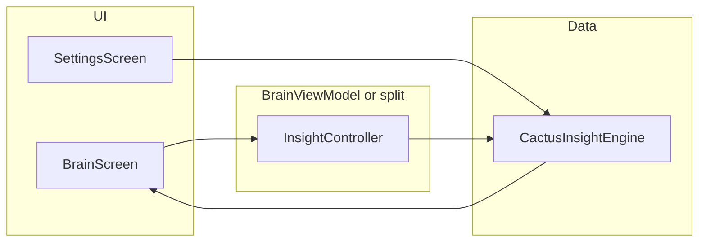

# Cactus analytical insight + anatomical brain glow

## Context (from repo)

- **Remove targets** live in [`app/src/main/java/dev/neurofocus/neurfocus_dnd/brain/ui/BrainScreen.kt`](app/src/main/java/dev/neurofocus/neurfocus_dnd/brain/ui/BrainScreen.kt): `AdvancedResearchRow` / `advancedResearch`, the `SegmentedModeControl` (“Cognitive enhancement” / “Emotional regulation”), and the `TooltipBubble` that only maps mode to static “Analytical thinking” / “Emotional balance” (no wiring to data).
- **Settings** today ([`SettingsScreen.kt`](app/src/main/java/dev/neurofocus/neurfocus_dnd/brain/ui/SettingsScreen.kt)) is profile + reset only; **no** model download path, **no** Cactus JNI in [`app/build.gradle.kts`](app/build.gradle.kts) or `jniLibs/`.
- **Cactus reference**: [`docs/cactus-computing-kotlin.md`](docs/cactus-computing-kotlin.md) — `cactusInit(modelPath, corpusDir, cacheIndex)`, `cactusComplete(...)`, `cactusDestroy`, blocking FFI on a worker thread.
- **Brain glow** today: [`BrainCanvas.kt`](app/src/main/java/dev/neurofocus/neurfocus_dnd/brain/ui/BrainCanvas.kt) `drawLiveGlows` uses **moving** centers (`dx`/`dy` from volatility) and large radial circles — conflicts with “don’t move the SVG” and “less blur.”
- **Cloud**: per your choice, **v1 = no cloud HTTP**; if local model missing or init fails, show clear error + **link / instructions to download** the model (URL string in UI or open browser intent).

---

## 1) Strip non-functional Brain UI

In [`BrainScreen.kt`](app/src/main/java/dev/neurofocus/neurfocus_dnd/brain/ui/BrainScreen.kt):

- Delete `MappingMode`, `SegmentedModeControl`, `advancedResearch` state, `AdvancedResearchRow`, and the old `TooltipBubble` usage tied to mode.
- Replace with **one** primary readout: **dynamic analytical insight** text (short, 1–2 lines max) sourced from a new ViewModel/state (see §3). Keep `BrainCanvas`, `BrainMeter`, `AdviceLine` layout sensible (spacing unchanged unless needed).

---

## 2) Settings: local Cactus model lifecycle (download + load + status)

Extend [`SettingsScreen.kt`](app/src/main/java/dev/neurofocus/neurfocus_dnd/brain/ui/SettingsScreen.kt) with a **“On-device model (Cactus)”** card:

- **Display**: resolved file path (under `context.filesDir` e.g. `files/cactus/model.gguf` or whatever extension Cactus expects), bytes on disk, state machine: `Idle | Downloading(progress) | Ready | Error(message)`.
- **Actions**: “Download / replace model” (uses a **fixed documented URL** constant in code or `strings.xml` — the HuggingFace model page from the doc’s `huggingface.co/Cactus-Compute` family; actual file URL chosen once and versioned), “Delete local model”, “Retry init”.
- **Persistence**: extend [`UserPrefs.kt`](app/src/main/java/dev/neurofocus/neurfocus_dnd/onboarding/UserPrefs.kt) (or add `CactusModelPrefs.kt`) with keys: `local_model_path` or `model_file_name`, `last_download_ok`, optional `last_error`.
- **Download implementation**: `kotlinx.coroutines` + `OkHttp` (add dependency) streaming to temp file then atomic rename into `filesDir`; `INTERNET` + `POST` not needed beyond GET; add [`INTERNET` permission](app/src/main/AndroidManifest.xml) for download only.
- **Threading**: never call Cactus FFI on main thread — use `Dispatchers.IO` or a single-thread executor for `cactusInit` / `cactusComplete` / `cactusDestroy` (matches doc: blocking).

**Native binary**: document in plan execution that `libcactus.so` must be placed under [`app/src/main/jniLibs/arm64-v8a/`](app/src/main/jniLibs/arm64-v8a/) per doc; add `Cactus.kt` JNI wrapper under e.g. `dev.neurofocus.neurfocus_dnd.cactus` (or `com.cactus` if you prefer exact doc layout). `build.gradle.kts`: ensure `ndk { abiFilters += "arm64-v8a" }` if you need to avoid packaging missing ABIs.

**v1 no cloud**: if `cactusInit` fails or file missing, Settings + Brain insight show **actionable error** (“Add model via Settings → Download” / open HF link via `Intent.ACTION_VIEW`).

---

## 3) Dynamic “analytical thinking” via Cactus

**Architecture**

- Add `CactusInsightEngine` (or `AnalyticalInsightRepository`) responsible for:
  - **Lifecycle**: `ensureLoaded()` reads prefs path → `cactusInit` or returns disabled state.
  - **Inference**: on `BrainState.Live` updates (throttled e.g. **1 request / 2–4 s** to avoid cooking the phone), build a compact JSON prompt from `bandPowers` + `focus` + `effectiveRateSps` (and maybe `windowRmsUv`), system prompt: “One concise analytical sentence about current EEG state, no medical diagnosis.”
  - **Output**: `StateFlow<InsightUiState>` with `text`, `loading`, `error`.
- **BrainViewModel** ([`BrainViewModel.kt`](app/src/main/java/dev/neurofocus/neurfocus_dnd/brain/ui/BrainViewModel.kt)): collect `state` (Live only), forward throttled snapshots to engine; expose `insight` to `BrainScreen`.
- **Failure modes**: model missing, init fail, complete timeout → show last good line or placeholder + tap-to-retry.

---

## 4) Brain glow: anatomical map, fixed positions, less blur, band-driven cycle

**Constraints**

- **Do not translate/scale the `Image` / SVG** beyond what already exists for envelope/blink in [`BrainCanvas.kt`](app/src/main/java/dev/neurofocus/neurfocus_dnd/brain/ui/BrainCanvas.kt); all changes are in the **glow Canvas behind** the icon.
- Replace **positional jitter** (`dx`/`dy` from volatility) with **fixed normalized (cx, cy)** centers tuned once to match **superior view** of [`ic_brain.xml`](app/src/main/res/drawable/ic_brain.xml) (same orientation as your reference: **frontal = top**, **occipital = bottom**, **longitudinal fissure = vertical midline**).

**Region model**

Introduce a small table (e.g. `BrainGlowRegion` enum + data class) covering your label list, each with:

- `anchorX`, `anchorY` in **0..1** box space (fixed).
- `primaryBand: EegBand` (dominant driver for **pulse frequency** and brightness scaling).
- `diagramColor: Color` (match reference: **frontal blue**, **parietal magenta/pink**, **occipital orange**, **longitudinal fissure** cool neutral, **central sulcus** narrow strip between motor/sensory, hemispheres slightly offset L/R with paired colors).

**Suggested mapping (tunable in one file)**

| Region | Approx position (superior) | Primary band driver | Diagram-like color |
|--------|---------------------------|---------------------|--------------------|
| Longitudinal fissure | midline, center-y | Delta (global slow) | indigo / cool white |
| Left / Right cerebral hemisphere | mid-left / mid-right bulk | Theta (or split Theta L/R) | cyan variants |
| Frontal lobe | top center mass | Low beta | bright blue |
| Precentral / motor + Postcentral / sensory | narrow band across midline, slightly below frontal peak | High beta / Gamma split | amber vs orange accents straddling “central sulcus” strip |
| Parietal lobe | mid-upper between motor strip and occipital | Gamma | magenta/pink |
| Occipital lobe | bottom center | Alpha | orange |
| Central sulcus | very thin vertical or short line region between the two strips | contrast of LowBeta vs HighBeta | neutral highlight |

**Visual changes**

- **Less blur**: reduce `outerR`, use **3-stop** radial gradients with **steeper falloff** (higher mid-stop alpha, smaller radius), optionally drop the oversized outer halo for sulcus/fissure specs.
- **More cycle**: per region `phaseSpeed = baseHz * (0.35f + bandPower * 1.4f)` multiplied by band-specific constant (gamma faster than delta); modulate **alpha** and/or **inner radius** with `sin(accumulatedPhase)` where phase advances each frame using `InfiniteTransition` + per-region derived frequency from **that region’s primary band power** (and optionally a slow global clock).

**Code touchpoints**

- Refactor `drawLiveGlows` in [`BrainCanvas.kt`](app/src/main/java/dev/neurofocus/neurfocus_dnd/brain/ui/BrainCanvas.kt): remove center wobble; keep optional **micro** shimmer (≤1–2 px) only if you still want life without breaking alignment.
- Update preview in same file if glow signature changes.

---

## 5) Wiring & tests

- **MainActivity**: pass nothing new if insight lives entirely in `BrainViewModel`; Settings may need `Application` for paths — use `LocalContext.current.applicationContext`.
- **Manual test matrix**: no model file; partial download; corrupt file; successful init; Live streaming throttling; rotation (ViewModel survives).

---

## Deliverables checklist

| Area | Deliverable |
|------|-------------|
| Brain UI | Remove advanced research + cognitive/emotional segment; show Cactus-driven insight |
| Settings | Model download/delete/retry + status + open HF link |
| Native | `jniLibs/arm64-v8a/libcactus.so` + `Cactus.kt` per doc |
| Insight | Throttled `cactusComplete` from Live EEG snapshot |
| Glow | Fixed superior-view anchors, diagram colors, tighter gradients, band-scaled pulse |
